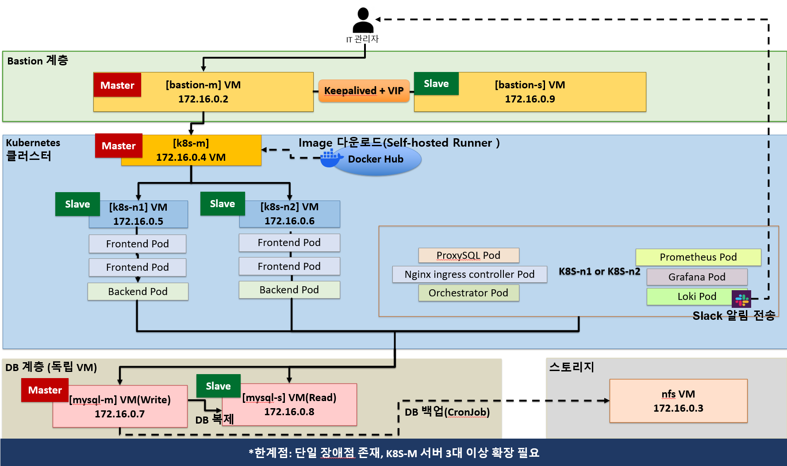

# k8s-plumbing-reservation-system

VMware 가상화 기술과 Kubernetes를 활용하여 실무 수준의 고가용성(HA) 인프라 및 관제 환경을 온프레미스(로컬) 서버에 구현한 배관 서비스 예약 플랫폼입니다.

---

## 아키텍처

<!-- 아키텍처 다이어그램 이미지 -->

> 이미지가 보이지 않는 경우 `docs/architecture.png` 파일을 확인해주세요.

---

## 핵심 구현 내용

**3-Tier 하이브리드 아키텍처**
Web/WAS는 Kubernetes 클러스터로 묶어 유연한 확장을 도모하고, DB는 K8s 외부의 독립된 VMware 가상머신으로 분리해 데이터 안정성을 높였습니다.

**DB 고가용성 및 로드밸런싱**
Master-Slave 복제 구조와 ProxySQL을 결합해 Read/Write 트래픽을 분리하고, 마스터 노드 장애 시 자동 Failover 환경을 구축했습니다.

**실시간 통합 관제**
K8s 내부 파드 상태부터 VMware 외부 서버의 하드웨어 지표(CPU/RAM/Disk), DB의 QPS까지 하나의 관리자 대시보드와 Grafana에서 15초 단위로 모니터링합니다.

**GitOps 기반 CI/CD**
GitHub Actions(Self-hosted Runner)와 Helm을 결합해 코드 푸시 한 번에 인프라 구성, 앱 배포, 모니터링 에이전트 설정까지 멱등성을 보장하며 자동 배포됩니다.

---

## 기술 스택

| 분류 | 기술 |
|---|---|
| **Frontend** | Next.js, TailwindCSS, React |
| **Backend** | Node.js, Express, MySQL2 |
| **Database & HA** | MySQL 8.0 (Master-Slave), ProxySQL |
| **Infrastructure** | VMware Workstation, Kubernetes, Nginx Ingress |
| **Observability** | Prometheus, Grafana, Alertmanager, Loki, Node Exporter |
| **CI/CD** | GitHub Actions (Self-hosted), Docker Hub, Helm |

---

## 인프라 구성

| 노드 | 역할 |
|---|---|
| `k8s-m` | Kubernetes Master |
| `k8s-n1`, `k8s-n2` | Kubernetes Worker (프론트/백엔드/모니터링) |
| `mysql-m` | Master DB |
| `mysql-s` | Slave DB |
| `bastion-m`, `bastion-s` | 접근 제어 / HAProxy |
| `nfs` | 중앙 집중식 로그 및 백업 스토리지 |

---

## 트러블슈팅

### 1. 외부 이미지 저장소 장애로 인한 배포 중단 (ImagePullBackOff)

**증상**
Orchestrator 배포 중 공식 Docker Hub 이미지 삭제로 `ErrImagePull` / `ImagePullBackOff` 무한 반복

**원인**
공식 프로젝트 이관으로 기존 `openark/orchestrator` 이미지가 비공개 처리 → 외부 레지스트리 의존으로 인한 배포 불가

**해결**
CI/CD 파이프라인에 자체 빌드 및 미러링 구조 도입, GitHub에서 소스코드를 직접 클론해 이미지를 빌드한 뒤 개인 Docker Hub에 푸시하는 방식으로 외부 의존성 제거

---

### 2. 서버 다운 시 모니터링 지연 문제 (유령 데이터)

**증상**
DB 서버가 다운되어도 관리자 대시보드에 즉각 반영되지 않고 약 5분 뒤에 `Down` 처리되는 현상

**원인**
PromQL에서 CPU/메모리 지표를 `[5m]` 평균으로 계산하면서, 서버가 죽은 이후에도 과거 데이터를 기반으로 평균값을 계속 반환해 서버가 살아있다고 오판

**해결**
15초 주기로 갱신되는 `up` 메트릭을 병렬로 조회하고, `up == 0`인 경우 평균 지표를 무시하고 즉시 `Down` 상태로 덮어쓰도록 로직 개선 → **장애 인지 시간 5분 → 15초로 단축**

---

### 3. 연쇄 알람 발생으로 인한 실제 장애 감지 어려움

**증상**
서버 다운 시 `InstanceDown` 외에도 데이터 수집이 끊기면서 실제와 무관한 알람이 연달아 발생해 정작 중요한 알람을 놓칠 위험 발생

**원인**
서버가 꺼지면 해당 서버의 CPU, 디스크 등 지표 수집도 함께 끊기는데, Prometheus가 이를 수치가 낮아진 것으로 해석해 오히려 정상으로 판단하는 현상

**해결**
Alertmanager에 억제 규칙(`inhibit_rules`) 추가, 서버 다운 알람이 발생하면 해당 서버에서 오는 하위 경고 알람은 자동으로 차단되도록 구성

---

### 4. Loki 로그 수집 시 스캔 범위 누락 및 시각 표기 오류

**증상**
모니터링 화면에서 에러가 발생했음에도 로그가 빈 배열로 나오거나, 발생 시각이 알아보기 힘든 숫자로 표기

**원인**
- Loki 로그 조회 시 특정 시점 한 순간만 스캔하는 API를 사용해, 그 순간에 로그가 없으면 빈 결과 반환
- Loki가 반환하는 시각 데이터가 나노초 단위라 그대로 화면에 출력되면 사람이 읽을 수 없는 숫자로 표기

**해결**
기간 범위 조회가 가능한 API로 변경해 최근 24시간 내 로그를 모두 수집하도록 개선, 나노초 단위 시각 데이터를 한국 시간(월/일 시:분:초) 형식으로 변환해 직관적으로 표시

---

### 5. 다중 파드 환경에서 점검 모드 상태 불일치

**증상**
관리자가 점검 모드를 활성화해도 일부 파드가 여전히 예약을 받는 문제

**원인**
점검 상태를 Node.js 로컬 메모리(전역 변수)에 저장 → K8s 로드밸런싱 환경에서 파드마다 상태가 달라지는 불일치 발생

**해결**
상태 저장소를 앱 메모리에서 MySQL `system_settings` 테이블로 이관, 모든 파드가 동일한 DB를 바라보도록 구성해 파드 수에 관계없이 즉시 동일한 점검 상태가 반영되도록 처리

---

### 6. ProxySQL 캐시로 인한 관리자 실시간 데이터 조회 지연

**증상**
ProxySQL에 `SELECT` 쿼리 캐싱(TTL 1시간) 적용 후, 관리자 페이지에서 최신 예약이 즉시 조회되지 않을 우려 발생

**원인**
ProxySQL Query Rule이 `SELECT`로 시작하는 모든 쿼리를 가로채 캐시된 과거 데이터를 반환

**해결**
관리자 전용 API 쿼리 앞에 `WITH _nc AS (SELECT 1)` 더미 구문을 삽입해 쿼리가 `WITH`으로 시작하도록 만들어 캐시 우회 → 일반 사용자 트래픽은 캐시로 방어하면서 관리자는 항상 Master DB 실시간 데이터 조회

---

### 7. ProxySQL 캐시로 인한 점검 모드 동기화 지연

**증상**
점검 모드를 활성화해도 간헐적으로 예약이 정상 접수되는 동기화 누수 발생

**원인**
ProxySQL 1시간짜리 캐싱 룰이 `system_settings` 조회 시 과거의 정상 상태(`false`)를 그대로 반환

**해결**
점검 상태 조회 API에도 `WITH _nc AS (SELECT 1)` 캐시 우회 기법을 적용, 점검 상태만큼은 캐시를 거치지 않고 항상 DB에서 직접 최신 값을 읽어오도록 처리
